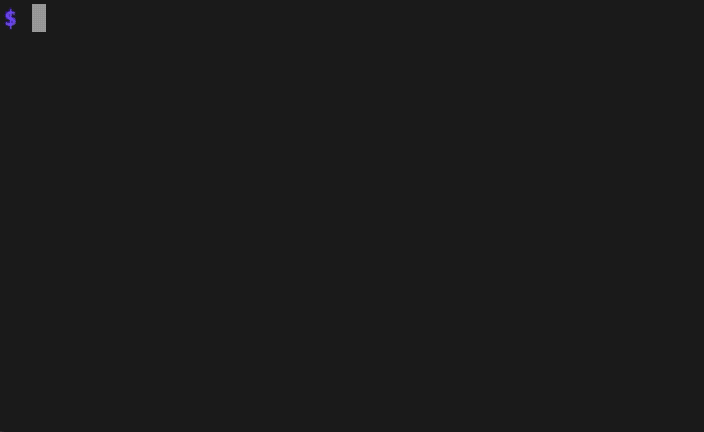
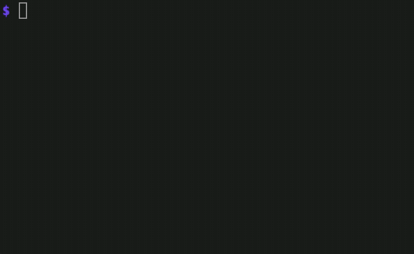

# Maze written in Go [](https://circleci.com/gh/matsuyoshi30/gomaze)

### Usage

```
$ go get -u github.com/matsuyoshi30/gomaze

$ gomaze
||||||||||||||||||||||||||||||||||||||||||||||||||||||||||||||
S           ||  ||                      ||  ||          ||  ||
||  ||||||  ||  ||  ||  ||||||||||  ||||||  ||  ||  ||||||  ||
||  ||  ||  ||      ||      ||  ||  ||  ||      ||      ||  ||
||||||  ||  ||  ||||||  ||||||  ||  ||  ||||||||||  ||  ||  ||
||  ||              ||  ||  ||          ||          ||  ||  ||
||  ||  ||  ||||||||||||||  ||||||  ||||||  ||  ||||||  ||  ||
||  ||  ||  ||                  ||          ||      ||  ||  ||
||  ||||||  ||||||  ||||||  ||||||  ||  ||  ||  ||  ||||||  ||
||          ||  ||  ||  ||  ||      ||  ||  ||  ||          ||
||  ||  ||||||  ||  ||  ||  ||  ||||||||||  ||||||||||||||  ||
||  ||          ||  ||  ||  ||  ||                  ||  ||  ||
||||||  ||||||  ||||||  ||  ||  ||||||||||||||||||||||  ||  ||
||      ||  ||          ||  ||  ||          ||  ||          ||
||||||||||  ||  ||||||||||  ||||||  ||||||  ||  ||  ||||||||||
||              ||  ||      ||      ||      ||      ||      ||
||||||  ||||||||||  ||  ||  ||  ||  ||||||||||  ||  ||  ||||||
||      ||  ||  ||      ||  ||  ||  ||          ||      ||  ||
||  ||||||  ||  ||||||  ||  ||  ||  ||  ||||||  ||||||  ||  ||
||  ||              ||  ||  ||  ||      ||  ||  ||  ||      ||
||  ||||||||||  ||||||  ||||||||||||||  ||  ||  ||  ||  ||||||
||      ||          ||              ||  ||  ||      ||  ||  ||
||  ||||||  ||||||||||  ||||||||||  ||  ||  ||  ||  ||||||  ||
||  ||              ||  ||                  ||  ||          ||
||  ||||||||||  ||||||  ||||||  ||||||||||||||||||  ||||||  ||
||      ||  ||  ||  ||      ||  ||  ||              ||      ||
||||||  ||  ||  ||  ||  ||||||  ||  ||||||||||  ||||||||||||||
||          ||          ||              ||  ||              ||
||  ||  ||  ||||||||||  ||||||||||||||||||  ||  ||||||  ||  ||
||  ||  ||      ||          ||                      ||  ||   G
||||||||||||||||||||||||||||||||||||||||||||||||||||||||||||||
```

You can specify the size of maze with `--height` or `--width`.  

```
$ gomaze --height 10 --width 10
||||||||||||||||||||||
S       ||      ||  ||
||||||  ||  ||||||  ||
||      ||          ||
||  ||||||  ||  ||||||
||  ||      ||      ||
||  ||  ||  ||||||  ||
||      ||      ||  ||
||||||  ||  ||||||  ||
||      ||      ||   G
||||||||||||||||||||||
```

You can play the maze with `--screen` and use arrow keys.



You can see the maze solution with `--bfs` or `--dfs`.

